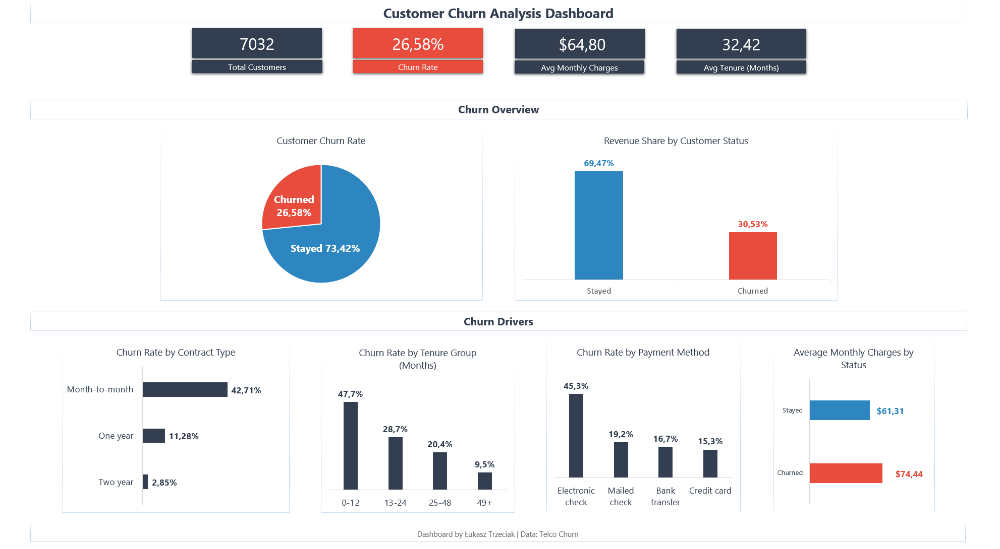

# 📊 Customer Churn Analysis

## 🧩 Business Problem

Customer churn is one of the most critical challenges for subscription-based businesses.
Understanding **why customers leave** helps companies improve retention strategies and reduce revenue loss.

The objective of this project was to analyze customer churn patterns and identify the key factors influencing customer attrition.

The analysis focuses on customer behavior, contract types, tenure, and payment methods to uncover potential churn drivers.

---

## 📁 Dataset

This project uses the **Telco Customer Churn dataset** available on Kaggle.

Dataset size:

* **7,032 customers**

Key features include:

* Customer tenure
* Contract type
* Payment method
* Monthly charges
* Churn status

Dataset link:
https://www.kaggle.com/datasets/gncgulce/telco-churn

---

## 🛠 Tools Used

* **MySQL** – data analysis and queries
* **DBeaver** – database management
* **Microsoft Excel** – dashboard and data visualization
* **GitHub** – project documentation

---

## 📈 Key Performance Indicators (KPIs)

The following metrics were calculated:

* Total Customers
* Churn Rate
* Average Monthly Charges
* Average Customer Tenure

These KPIs provide a high-level overview of customer retention and revenue potential.

---

## 🔍 Key Insights

Key findings from the analysis:

* **26.58% of customers churned**, meaning more than one quarter of the customer base has left.
* **Month-to-month contracts show the highest churn rate (42.71%)**, indicating contract flexibility increases churn risk.
* Customers with **short tenure (0–12 months)** churn the most frequently.
* Customers who churn tend to have **higher monthly charges ($74.44)** compared to retained customers.
* **Electronic check payments have the highest churn rate (45.3%)**, suggesting a potential link between payment method and churn behavior.

These insights suggest that improving long-term contracts and targeting high-risk customer segments could reduce churn.

---

## 📊 Dashboard

The Excel dashboard includes the following analyses:

* Customer churn rate
* Revenue share by customer status
* Churn rate by contract type
* Churn rate by tenure group
* Churn rate by payment method
* Average monthly charges by customer status

### Dashboard Preview

---

## 📂 Project Structure

customer-churn-analysis/

│

├── sql/

│   └── churn_analysis.sql

│

├── excel/

│   └── churn_dashboard.xlsx

│

├── screenshots/

│   └── dashboard.png

│

└── README.md

---

## 🎯 Conclusion

The analysis highlights that **short-term contracts and early customer lifecycle stages are the main churn drivers**.

Businesses can reduce churn by:

* Encouraging longer contract commitments
* Improving onboarding during the first year
* Identifying high-risk customers with high monthly charges

The analysis highlights key churn drivers and demonstrates how data can be used to support customer retention strategies.

The results are presented through SQL analysis and a business-oriented Excel dashboard.
